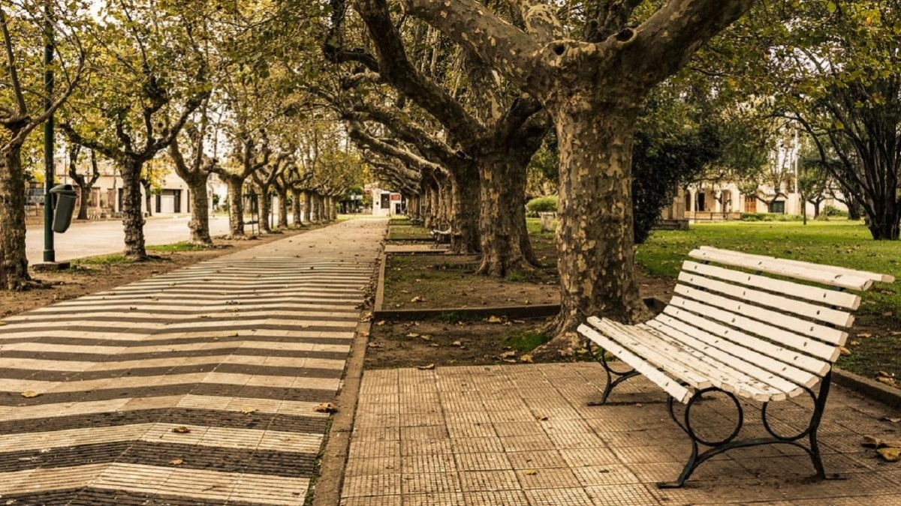

# Alberti Recuerda

**Alberti Recuerda** es un proyecto web que busca preservar la memoria colectiva de Alberti, a través del relato de historias personales asociadas a lugares del pueblo.

> Todos tenemos un tesoro: un recuerdo por compartir.

## ✨ Objetivo

Este proyecto tiene como propósito invitar a la comunidad a reconectar con su historia y su identidad, compartiendo imágenes, videos o relatos vinculados a sitios que marcaron su vida cotidiana.

## 📸 Características

- ✅ Intro animada con GSAP: video fullscreen que se transforma en hero responsivo.
- ✅ Diseño emocional y minimalista.
- ✅ Historias personales narradas con imágenes o videos.
- ✅ Interfaz responsive y liviana.
- ✅ Código abierto y modular (HTML + CSS + JS).
- ✅ Integración con Vercel para despliegue rápido.

## 🧪 Tecnologías utilizadas

- HTML5
- CSS3
- JavaScript (GSAP librería de animaciones)
- Vercel (Hosting)

## 🌱 Cómo contribuir

¿Querés formar parte de esta memoria viva?  
Te invitamos a compartir tu historia:

1. 📷 Subí una imagen o video que represente un lugar significativo de Alberti.
2. ✍️ Escribí un relato o recuerdo vinculado a ese espacio.
3. 📩 Escribiéndonos por el formulario de contacto (próximamente).

> Tu historia también es parte de la historia de todos.

## 🖼️ Vista previa

## 🚀 Deploy en Vercel

Este sitio está optimizado para ser desplegado rápidamente con Vercel:

---

Gracias por mantener viva la memoria 💛  
**- Equipo de Punto Digital Alberti**
